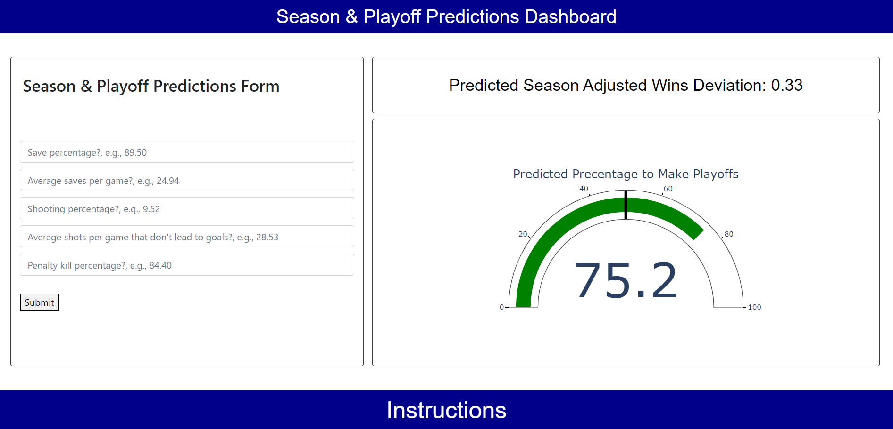
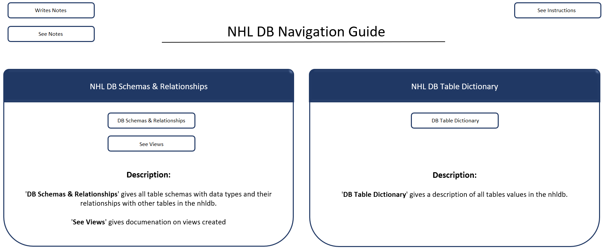

# NHL Linear & Logistic Regression Analysis

## Project Description

The analysis explored NHL team season data (url: https://www.kevinsidwar.com/iot/2017/7/1/the-undocumented-nhl-stats-api) from 1983 - 2020 to predict season and playoff outcomes (url: https://en.wikipedia.org/wiki/List_of_NHL_playoff_series).

The season outcomes were calculated by how many adjusted wins a team won (wins + (ties / 2)) above the mean adjusted wins of any given season. The season outcome was calculated this way due to the varying nature of hockey; in some seasons, teams were closer in regards to games won and some had a greater divide. In addition, some seasons were longer than other seasons and by using the adjusted games a team won **(wins + (ties / 2))** above the mean adjusted wins of any given season metric, all seasons were included in the analysis despite some seasons having less games played (shortened due to strike and pandemic).

More than 60% of teams make the playoffs, so the analysis set out to predict teams that did not make the playoffs.

The entirety of the analysis sought to understand the statistical economics of what NHL team organizations can focus on to reach the post-season. 

By understanding the economics of what hold teams back from making playoffs, teams can gain more transparency and perspective on what works with strategy and achieving successful campaigns in mind.

Achieving successful campaigns can potentially lead to increased revenue for all stakeholders through ticket sales, salary increases, endorsement deals, fair book value of the organization, greater economic activity for the represented city, etc.

## Methods Used

1) Descriptive Statistics - used for preliminary data exploration.
2) Multiple Linear Regression - Predict season outcomes (adjusted wins a team won (wins + (ties / 2)) / mean adjusted wins).
3) Logistic Regression - Used predicted season outcomes to predict playoff outcomes.

## Dashboard

<strong>App User Name:</strong> data  <strong>App Password:</strong> analyst  <strong>Note -</strong> the dashboard takes a few seconds to load

* Deployed to Heroku here: https://nhl-dash-app.herokuapp.com/

## Presentation Deck

* Deployed here: https://1drv.ms/p/s!Aq0DLMt0IS3zgnZOju4z9H5Gz3Yb?e=beWNGZ

## NNHL Database Documentation Dashboard (open on desktop for macro functionality)

* Deployed here: https://1drv.ms/x/s!Aq0DLMt0IS3zgneW6LwCXfqNrkkY?e=h4iwKY

## Technologies 

1) Python 
2) Jupyter Notebook
3) Tableau
4) Microsoft Excel
5) Microsoft PowerPoint

